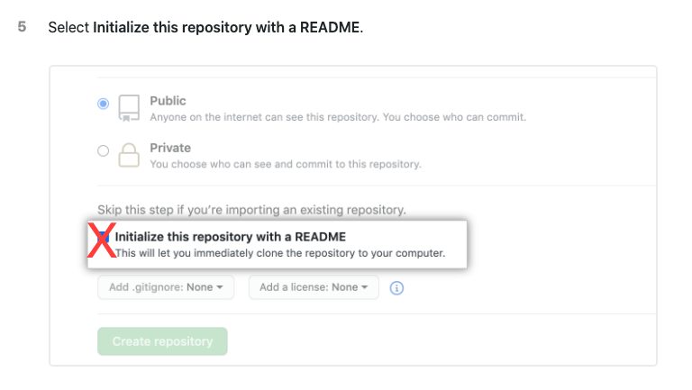
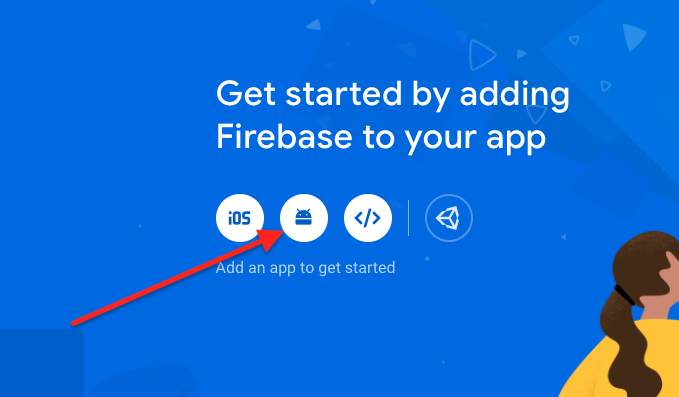

id: ci-cd-workshop-prerequisites

summary: These are prerequisites for the CI/CD workshop.

authors: Artyom Okun, Nitzan Werber

# Android Academy CI/CD Workshop Prerequisites
<!-- ------------------------ -->
## Repository Setup

##### To save time during the workshop itself, we decided to create these prerequisites that include some environment preparations, which are kind of "standard" and necessary for saving time and focusing during this workshop on what important. So please follow the instructions carefully and if you have any questions feel free to ask them via [Telegram Channel](https://t.me/joinchat/LTwIFUUp6E4Z5DP7WJYVsA) or [Facebook Group](https://www.facebook.com/groups/android.academy.ils). 

Duration: 0:05:00

<span>&nbsp;&nbsp;1.</span> Create a new "Hello World" application in Android Studio.<br/>
<span>&nbsp;&nbsp;2.</span>  Build and compile a project.<br/>
<span>&nbsp;&nbsp;3.</span>  Create a Github repository for this project. You can follow the instructions [here](https://docs.github.com/en/free-pro-team@latest/github/getting-started-with-github/create-a-repo).<br/>
 &nbsp;&nbsp;&nbsp;&nbsp;&nbsp;&nbsp;*Please note - during the project creation, do not mark to create any files on your behalf, just leave all checkboxes empty like this one:*<br/>
 
<br/><span>&nbsp;&nbsp;4.</span> Open terminal in Android Studio and run: <br/>

```bash
mkdir -p .github/workflows && cd .github/workflows && touch test.yaml
```

<br/><span>&nbsp;&nbsp;5.</span>  Create first commit (we just want to verify our local copy is synced with remote). From the app root folder, open terminal and run:

*Note: pay attention to change a path to Github repository in the next script*

``` bash
git init
git add .
git commit -m "Initial commit"
git remote add origin <path to your repository i.e. git@github.com:rtokun/test-111.git>
git push origin main
```

If you wasn't able to commit and push please see troubleshooting <a href="#3" target="_self">here</a> or ask for help in our [Telegram Channel](https://t.me/joinchat/LTwIFUUp6E4Z5DP7WJYVsA) or [Facebook Group](https://www.facebook.com/groups/android.academy.ils).

## Create Firebase Project

#### We want to create a Firebase project and connect it to our application.

#### 1. Create a Firebase project for our app

1. Go to [Firebase console](https://console.firebase.google.com/), login, and click `Add project`.
2. Follow the wizard instructions and complete project creation, including entering package details from our app (exact package name can be found in `Manifest.xml` file).
3. In the project overview click `Add app`:

4. Select `Android` and follow the wizard. Complete the wizard including downloading the `google-services.json` file and putting it inside the `app` folder, and modifying the Gradle files.
5. Make sure to compile and run the application on the emulator/device after successful integration.
6. Commit and push all changes you have done to the Github repo.

#### 2. Create Firebase Login token

This token allows to 3rd party applications to get access to the Firebase project and make operations. We will use this token in the workshop.
To get one we need to install the Firebase console client on our local computer and login via client to our Firebase account.

&nbsp;&nbsp;1.</span> Open terminal and enter<br/>

``` bash
curl -sL https://firebase.tools | bash
```

&nbsp;&nbsp;<span>2.</span> After successful installation enter in terminal:<br/>

``` bash
firebase login:ci
```

It will open the browser with the Authentication page. Enter your credentials and after successful authentication go back to your terminal window, you should see there your token:

``` bash
✔  Success! Use this token to log in on a CI server:

1//03UkAUZpVhigPCgYIARAAGsotbjnrtl;ghkjnrts;lhkjntw;lhknrt;lhbknwrtl;khn;wlr0VcRQiYGtZSpo7DP1aS7X5OdCVJys
```

&nbsp;&nbsp;<span>3.</span> Copy this token to safe place, we will use it during workshop.<br/>

## Summary

#### At the end of these prerequisites we have to get 4 things:

1. Android "Hello World" starter project.
2. Created the Github repository and connected it to our local app.
3. Firebase project was created and integrated into our app as well.
4. Firebase access token.


#### See you at the workshop! ❤️

## Troubleshooting

#### 403 Failure during push to the remote

1. Please verify that your github credentials are correct.
2. Try to connect via SSH rather than HTTPS. If you still want to use HTTPS, please use Github private access token instead of password for your account:
<br/>&nbsp;&nbsp;<span>1.</span> Follow instructions [here](https://docs.github.com/en/free-pro-team@latest/github/authenticating-to-github/creating-a-personal-access-token#creating-a-token) to create access token (Please make sure to mark all permissions checkboxes during token creation).
<br/>&nbsp;&nbsp;<span>2.</span> Go to `Android Studio -> Settings/Preferences -> Version Control -> GitHub`.
<br/>&nbsp;&nbsp;<span>3.</span> Click the `+` button.
<br/>&nbsp;&nbsp;<span>4.</span> In the dialog that opens, select `Use token` and paste your token.
<br/>&nbsp;&nbsp;<span>5.</span> Save and try to push to the repository again.